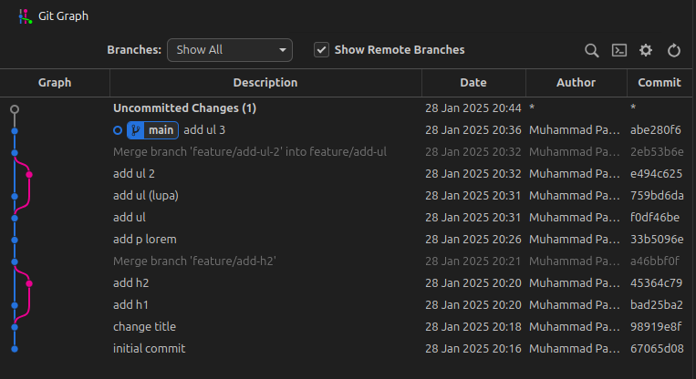

# Learning GIT

- `git merge` menggabungkan commit dari branch lain (membuat commit baru)
- `git rebase` mirip seperti `git merge` tapi menyimpan commit dari branch yang di merge ke branch utama (langsung)

## Penting

- Hindari rebase pada cabang yang sudah di-push ke remote. Hal ini dapat menyebabkan konflik dan membuat rekan kerja kesulitan untuk melakukan merge.
- Gunakan rebase dengan hati-hati. Meskipun rebase memiliki keuntungan, namun jika digunakan secara sembarangan dapat menyebabkan masalah.

- `git stash` untuk menyimpan perubahan sementara tanpa commit, jadi biasanya ketika kita mengerjakan sesuatu di branch A, tapi kita sadar ada yang lupa pada branch main, namun ketika kita ingin pindah ke branch main, perubahan yang ada pada branch A akan ikut ke branch main, jadi dari pada buat commit baru, mending pakai `git stash` nanti ketika kembali ke branch A lagi, tinggal pakai `git stash pop`

- `git branch`
- `git branch --merged` lihat branch yang sudah di merged
- `git branch --no-merged` lihat branch yang belum di merged
- `git branch -d` delete merged branch
- `git branch -D` delete merged branch (meskipun unmerged branch)
- `git log --oneline --graph --all --decorate`

- `git revert` untuk meng undo last commit dengan membuat commit baru (jadi tidak menghapus commit yang ingin di hapus/undo), cocok untuk menghapus perubahan yang telah terjadi di remote atau main branch
